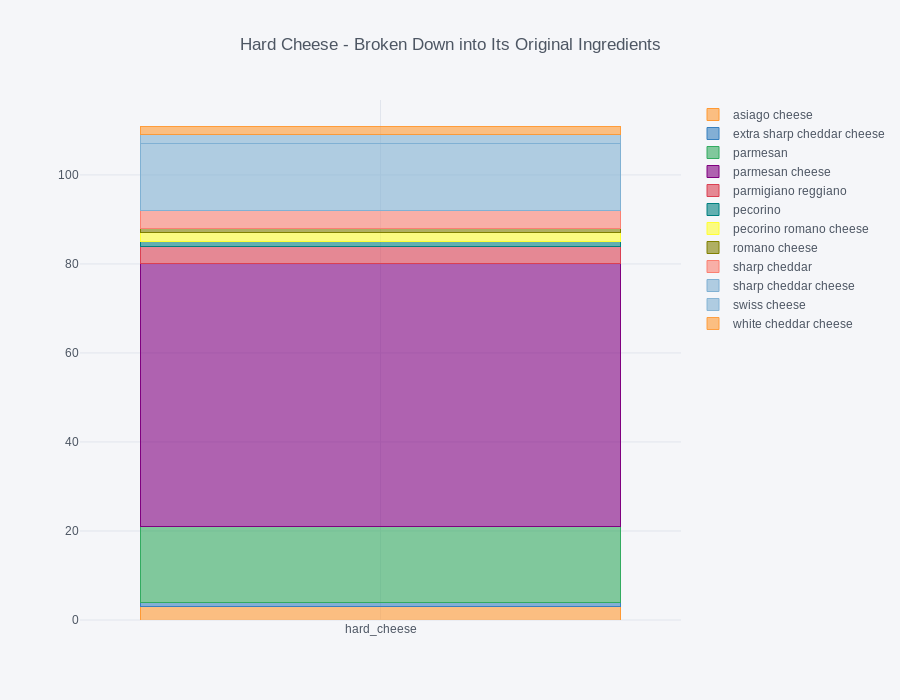

# Flavor-based Recipe Recommender

## Motivation
While it doesn't make me unique, I love food. I also love to cook. I spend countless  hours each weekend looking for new and interesting recipes before I head off  to the grocery store. Having a tool that  uses a recipe’s underlying flavor, ingredient contexts and categorical features to recommend new recipes  would not only save me time, but introduce diversity into my weekly meal plans.

## Flavor/Context-based vs. Ingredient-based
When it comes to ingredients, many times the "flavor" of the ingredient is synonymous with the ingredient itself. For example, the ingredient "tomato" is easily associated with the flavor of "tomato". But, there are many types of tomatoes, for example: roma, beefsteak, green, cherry. While none of the types listed have an identical flavor profiles, it is probably safe to say that in a pinch, a beefsteak tomato is going to be a better replacement for a roma than a green tomato or a cherry tomato. The goal of this project is to be able to recommend recipes with similar flavors and not just identical ingredients. For recipes that contain cherry tomatoes as a garnish, I would like to recommend other recipes not just with "cherry tomtoes" explicitly listed, but also with "grape tomatoes" used in similar context in the recipe. At the same time, I would prefer to not return a recipe that for example, stews roma tomatoes down into a sauce.

## Data & Feature Selection

The recipe data was gathered using a food API. The API has functionality allowing parameters filters to be passed with the request, but I pulled recipes using an endpoint that returns recipes at random, to hopefully get a diverse corpus in terms of ingredients and categorical features.

Each recipe is a group of nested dictionaries. Dictionary keys and corresponding value type shown below:

``` python
recipe_json = {'vegetarian': bool,
              'vegan': bool,
              'glutenFree': bool,
              'dairyFree': bool,
              'veryHealthy': bool,
              'cheap': bool,
              'veryPopular': bool,
              'sustainable': bool,
              'weightWatcherSmartPoints': int,
              'gaps': str,
              'lowFodmap': bool,
              'ketogenic': bool,
              'whole30': bool,
              'sourceUrl': str,
              'aggregateLikes': int,
              'healthScore': float,
              'creditText': str,
              'sourceName': str,
              'pricePerServing': float`,
              'extendedIngredients': lst of dicts,
              'id': int,
              'title': str,
              'readyInMinutes': int,
              'servings': int,
              'image': str,
              'imageType': str,
              'cuisines': lst,
              'dishTypes': lst,
              'diets': lst,
              'occasions': list,
              'winePairing': dict,
              'instructions': str,
              'analyzedInstructions': lst of dicts,
              'creditsText': str}
```
For my recommender, I chose to use the ingredient names, diet types, cuisines types, and dish types as the features for comparison.

While some of the diets have their own key-value pair (ex: 'vegetarian', 'vegan'), not all diets existing in the 'diets' value list, had their own boolean fields, so the diet features were created from provided lists.

## Feature Enginering
All categorical, non-ingredient features were dummified.  
##### diet features  
``` python
['dairy_free','fodmap_friendly','gluten_free','keto','paleo','pescatarian','primal','vegan','vegetarian','whole_30']
```

| A recipe can have more than one diet tag. Counts of the different combinations of diets associated to a single recipe: | Raw diet counts, without grouping: |
|:--------------------------------:|:-----------------------------------:|
|  |   |

###### cuisine features  
``` python
['african','american','asian','bbq','british','cajun','caribbean','central_american','chinese','eastern_european',
'english','european','french','german','greek','indian','irish','italian','japenese','jewish','latin_american',
'mediterranean','mexican','middle_eastern','scottish','south_american','southern','spanish','thai','vietnamese']  
```
| A recipe can have more than one cuisine tag. Counts of the different combinations of cuisines associated to a single recipe: | Raw cuisine counts, without grouping: |
|:--------------------------------:|:-----------------------------------:|
|  |   |  

##### dish type features  
``` python
['appetizer','batter','beverage','bread','breakfast','condiment','dessert','dinner','dip','lunch','main_dish',
'salad','side_dish','snack','soup','spread']
```
| A recipe can have more than one dish type tag. Counts of the different combinations of dish types associated to a single recipe: | Raw dish type counts, without grouping: |
|:--------------------------------:|:-----------------------------------:|
|  |   |  

All ingredients were bucketed into flavor/context buckets and dummified. Values of ingredient features are booleans, the instance of an ingredient existing in a recipe. Counts and/or tf-idf were not used.

##### Example of Grouping of Ingredients by Flavor/Context:
| Original Ingredient String     | Intended Mapped Ingredient   |
|:-------------:|:-------------:|
| chicken bouillon, chicken bouillon cube, chicken broth      | chicken_stock |
| bone in chicken thighs, chicken, chicken breast, shredded chicken    | chicken   |
| lean ground turkey, ground beef, ground chicken       | ground_meat     |

Standard NLP/bag-of-words preprocessing introduced issues for a flavor/context-based recommender as described above.

##### Example Issues:  
| Process       | Issue          | Example Original Ingredient(s)  | Example Output | Intended Mapped Ingredient
|:-------------:|:-------------:| :-----:|:-----:|:-----:|
| Tokenization      | Creates tokens that are not actual ingredients | ‘shredded chicken’ | [‘shredded’, ‘chicken’] | chicken |
| Tokenization   | Separates ingredient from modifiers that could dictate output. | ‘chicken bouillon’ | [‘chicken’, ‘bouillon’] | ‘chicken_stock’ |
| Tokenization (n-grams) | Creates ingedients that don’t exist in recipe  | ‘greek yogurt’ ‘cayenne pepper’  | [‘greek yogurt’, ‘yogurt cayenne’, ‘cayenne pepper’] | ‘greek_yogurt’ ‘ground_chile’ |
| Removing “stop words”  | Removes important modifiers in an effort to distinguish recipes | ‘chicken bouillon’ | [‘chicken’, ‘bouillon’] → remove ‘bouillon’ → [‘chicken’] | ‘chicken_stock’ |

| Original Unique Ingredients    | Bucketed Unique Ingredients   |
|:-------------:|:-------------:|
|    1727   | 440 |

##### Example Ingredient Buckets & the Original Ingredients Mapped to It:

| Soft Cheese | Hard Cheese |
|:--------------------------------:|:-----------------------------------:|
|  |   |  

| Mild Fish | Strong Fish |
|:--------------------------------:|:-----------------------------------:|
|  |   |  

| Chicken |
|:--------------------------------:|
|  |

## Measure of "Closeness"
  
**source Wikipedia*

## Workflow  


## Results  

|                                 Recipe                                 |                    Top Recommendation                   |
|:----------------------------------------------------------------------:|:-------------------------------------------------------:|
|             'Summer Grilled Mexican Street Corn Fettuccine'            |       'Smoked Corn Chowder with Crispy Duck Skin'       |
|                   'Havarti and herb breakfast bread'                   |           'Mini Mushroom and Arugula Quiches'           |
|                        'Thai Chicken Enchiladas'                       |  ‘Cilantro Lime Grilled Chicken with Strawberry Salsa'  |
|                          'Zesty Baked Catfish'                         |          'Gluten Free Curried Grilled Halibut'          |
|                           'Pecan Coffee Cake'                          |             'Salted Caramel PayDay Cupcakes'            |
| 'Brown Sugar Honey Marinated Salmon with Caramelized Pineapple Quinoa' |          'Honey Mustard Bacon Chicken Skillet'          |
|              'Gingerbread Cake with Cream Cheese Frosting'             | 'Zucchini Bars with Brown Butter Cream Cheese Frosting' |

## Future Improvements
+ Flavor/context mapping needs additional reorganization  
+ Automate majority of ingredient mapping to allow new recipes to be added to the corpus easily  
+ Allow user input to dictate weighting of features for more tailored recommendations
